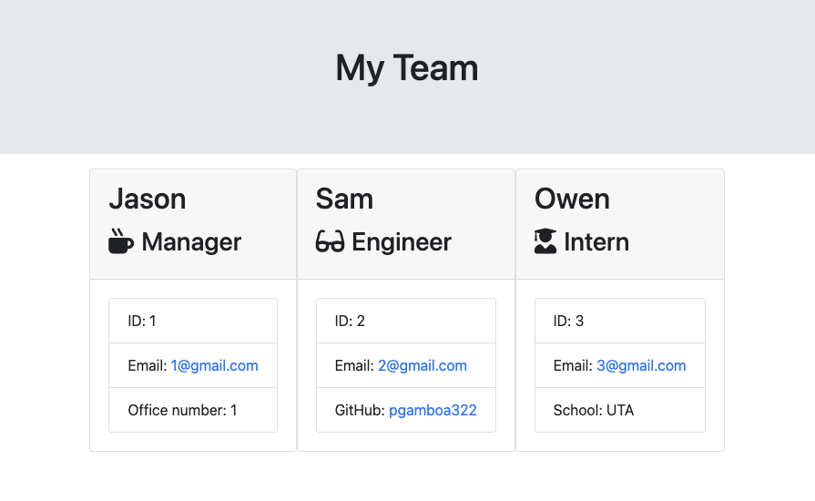

# Team Profile Generator

Team Profile Generator is a node app that uses the CL and inquirer to accept information about employees to then generate an HTML webpage.

## User Story
AS A manager I WANT to generate a webpage that displays my team's basic info
SO THAT I have quick access to their emails and GitHub profiles

## Installation
Download/clone repository, requires node.js, do npm install to install the required npm dependecies

## Screenshots & Video

[Video Demo](https://drive.google.com/file/d/1otqpoSULlYnJPwh7tgc4DveqgpahYTWr/view)

## Links

Github link: https://github.com/pgamboa322/team-profile-generator